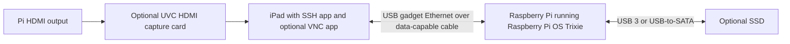
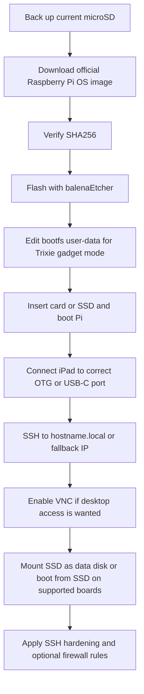

# Diagrams

## Connection flow (recommended setup)

```mermaid
flowchart LR
    Host[iPad with SSH app and optional VNC app]
    Pi[Raspberry Pi running Raspberry Pi OS Trixie]
    SSD[Optional SSD]
    CAP[Optional UVC HDMI capture card]
    HDMI[Pi HDMI output]

    Host <-- USB gadget Ethernet over data-capable cable --> Pi
    Pi <-- USB 3 or USB-to-SATA --> SSD
    HDMI --> CAP
    CAP --> Host
```

## Setup timeline

```mermaid
flowchart TD
    A[Back up current microSD] --> B[Download official Raspberry Pi OS image]
    B --> C[Verify SHA256]
    C --> D[Flash with balenaEtcher]
    D --> E[Edit bootfs user-data for Trixie gadget mode]
    E --> F[Insert card or SSD and boot Pi]
    F --> G[Connect iPad to correct OTG or USB-C port]
    G --> H[SSH to hostname.local or fallback IP]
    H --> I[Enable VNC if desktop access is wanted]
    I --> J[Mount SSD as data disk or boot from SSD on supported boards]
    J --> K[Apply SSH hardening and optional firewall rules]
```
